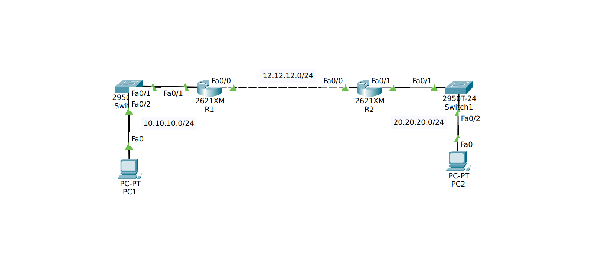
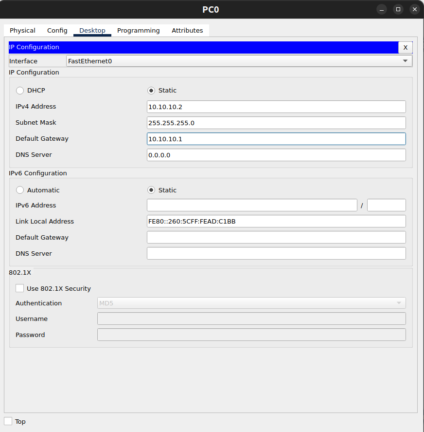

## Enhanced Interior Gateway Routing Protocol (EIGRP)
adalah routing protocol proprietary cisco, tapi sejak maret 2013 cisco membuka IEGRP sebagai standart terbuka untuk membantu perusahaan beroperasi dalam lingkungan multi vendor.IEGRP adalah protokol classles(support vlsm) yang artinya protokol ini mengirimkan subnet mask dari interface dalam routing table, menggunakan metric yang kompleks berdasarkan bandwidth dan delay. Protokol ini merupakan Hybrid Routing Protokol karena menggabungkan kelebihan dari distance vector dan link state, dan termasuk dalam protokol advanced distance vector protocol. EIRGP dirancang untuk konvergensi cepat, hemat bandwidth, dan mendukung load balancing.

### Karakteristik Utama
1. Menggunakan DUAL Algorithm(DUAL)
    Dalam menentukan jalur terbaik protokol EIGRP menggunakan algoritma Diffusing Update Algorithm(DUAL), algortima ini menjamin jalur bebas loop dan jalur cadangan diseluruh routing domain. DUAL menghitung jalur berdasarkan Feasible Distance dan Reported Distance.
2. Partial Update
    EIGRP tidak mengirim seluruh routing table seperti RIP yang dikirimkan hanya perubahan routing saja dan update hanya dikirim le router yang membutuhkan.
3. Triggered Update
    Update hanya dikirim ketika tology berubah.
4. Hello Packet
    EIGRP menggunakan hello packet untuk menemukan neighbor dan menjaga neighbor tetap aktif. secara default hello timer adalah 5 detik.

### Neighbor Discover
Syarat neighbor EIGRP:
1. AS number sama
2. K-value sama
3. Network terhubung langsung
4. Hello packet diterima

**```Successor```** adalah jalur terbaik menuju network tujuan
**```Feasible Successor```** adalah jalur backup, jadi jika successor mati akan langsung diganti tanpa dihitung ulang, ini membuat konvegensi sangat cepat.

### Packet Type EIGRP
- Hello: digunakan untuk mengidentifikasi neighbor.
- Update: Mengirim informasi routing
- Ack: Konfirmasi packet diterima
- Query: Mencari jalur baru atau alternatif
- Reply: Jawaban dari query

### Administrative Distance
Administrative Distance (AD) pada EIGRP adalah nilai yang menunjukkan tingkat kepercayaan router terhadap route yang dipelajari melalui protokol EIGRP dibandingkan dengan protokol routing lain. Semakin kecil nilai AD, semakin dipercaya route tersebut oleh router untuk dimasukkan ke routing table.
Pada EIGRP terdapat dua jenis nilai AD:
- EIGRP Internal Route
    Route yang dipelajari dari router lain yang berada dalam AS (Autonomous System) EIGRP yang sama.
- EIGRP External Route
    Route yang berasal dari luar EIGRP, misalnya dari protokol lain seperti OSPF, RIP, atau static route yang kemudian di-redistribute ke EIGRP.

### Load Balancing
Load Balancing pada EIGRP adalah kemampuan router untuk mendistribusikan trafik ke beberapa jalur menuju tujuan yang sama, sehingga penggunaan jaringan menjadi lebih efisien dan tidak hanya bergantung pada satu jalur saja.
Secara default, EIGRP mendukung equal-cost load balancing, yaitu ketika terdapat beberapa jalur dengan metric yang sama, router akan menggunakan semua jalur tersebut secara bersamaan untuk mengirim paket. Router Cisco secara default dapat menggunakan hingga 4 jalur sekaligus, namun jumlah ini dapat diubah dengan perintah maximum-paths.
Selain itu, EIGRP juga mendukung unequal-cost load balancing, yaitu kemampuan menggunakan beberapa jalur yang memiliki metric berbeda. Fitur ini jarang dimiliki oleh protokol routing lain dan dapat diaktifkan dengan perintah variance, yang memungkinkan router menggunakan jalur dengan metric lebih tinggi selama masih memenuhi syarat tertentu. Dengan mekanisme ini, EIGRP dapat memanfaatkan beberapa jalur sekaligus sehingga meningkatkan efisiensi penggunaan bandwidth dan ketersediaan jaringan.

## Simulasi

Karena saya kali ini akan fokus pada pemahaman konsep protocol routing dinamic EIGRP jadi saya membuat topologi yang sangat sederhana. Praktikum ini mensimulasikan implementasi routing dinamis EIGRP pada dua router yang saling terhubung melalui jaringan 12.12.12.0/24. Router R1 terhubung dengan jaringan lokal 10.10.10.0/24 yang digunakan oleh PC0 lewat Switch, sedangkan Router R2 terhubung dengan jaringan 20.20.20.0/24 yang digunakan oleh PC1 juga lewat Switch. Protokol EIGRP dikonfigurasi pada kedua router untuk mendistribusikan informasi routing secara otomatis sehingga kedua jaringan lokal dapat saling berkomunikasi. Setelah proses neighbor terbentuk dan routing table diperbarui, PC pada masing-masing jaringan dapat melakukan komunikasi antar jaringan melalui jalur yang dipelajari oleh EIGRP.

### R1 konfigurasi
```bash
Router>ena
Router#conf t
Enter configuration commands, one per line.  End with CNTL/Z.
Router(config)#host R1
R1(config)#int fa0/0
R1(config-if)#ip add 12.12.12.1 255.255.255.0
R1(config-if)#no sh
R1(config-if)#int fa0/1
R1(config-if)#ip add 10.10.10.1 255.255.255.0
R1(config-if)#no sh
R1(config-if)#exit
R1(config)#router eigrp 100
R1(config-router)#network 12.12.12.0
R1(config-router)#network 10.10.10.0
R1(config-router)#no auto-summary 
R1(config-router)#end
R1#wr m
Building configuration...
[OK]
R1#
```
- Perintah ```#router eigrp 100``` digunakan untuk mengaktifkan dan masuk ke mode konfigurasi protokol routing EIGRP dengan Autonomous System (AS) number 100 pada router.
- Perintah ```#network 12.12.12.0``` pada konfigurasi EIGRP digunakan untuk mengaktifkan EIGRP pada interface router yang memiliki IP dalam jaringan 12.12.12.0, sehingga interface tersebut dapat membentuk neighbor dengan router lain dan mengiklankan jaringan tersebut ke dalam proses routing EIGRP.
- Perintah ```#no auto-summary``` pada konfigurasi EIGRP digunakan untuk menonaktifkan fitur automatic classful summarization, sehingga router akan mengiklankan subnet sebenarnya (subnet mask yang asli), bukan merangkum jaringan berdasarkan kelas IP. Dengan perintah ini, EIGRP dapat mendukung VLSM (Variable Length Subnet Mask) dan memungkinkan router mengiklankan network yang memiliki subnet berbeda secara lebih akurat.

### R2 konfigurasi
```bash
Router>ena
Router#conf t
Enter configuration commands, one per line.  End with CNTL/Z.
Router(config)#host R2
R2(config)#int fa0/0
R2(config-if)#ip add 12.12.12.2 255.255.255.0
R2(config-if)#no sh
R2(config-if)#int fa0/1
R2(config-if)#ip add 20.20.20.1 255.255.255.0
R2(config-if)#no sh
R2(config-if)#exit
R2(config)#router eigrp 100
R2(config-router)#network 12.12.12.0
R2(config-router)#network 20.20.20.0
R2(config-router)#no auto-summary 
R2(config-router)#end
R2#wr m
Building configuration...
[OK]
```

### PC konfigurasi

``` Lakukan hal yang sama dengan PC2 dengan IP 20.20.20.2 255.255.255.0 dan gateway 20.20.20.1 ```

### Verifikasi dari R1
```bash
R1#sh ip route
Codes: C - connected, S - static, I - IGRP, R - RIP, M - mobile, B - BGP
       D - EIGRP, EX - EIGRP external, O - OSPF, IA - OSPF inter area
       N1 - OSPF NSSA external type 1, N2 - OSPF NSSA external type 2
       E1 - OSPF external type 1, E2 - OSPF external type 2, E - EGP
       i - IS-IS, L1 - IS-IS level-1, L2 - IS-IS level-2, ia - IS-IS inter area
       * - candidate default, U - per-user static route, o - ODR
       P - periodic downloaded static route

Gateway of last resort is not set

     10.0.0.0/24 is subnetted, 1 subnets
C       10.10.10.0 is directly connected, FastEthernet0/1
     12.0.0.0/24 is subnetted, 1 subnets
C       12.12.12.0 is directly connected, FastEthernet0/0
     20.0.0.0/24 is subnetted, 1 subnets
D       20.20.20.0 [90/30720] via 12.12.12.2, 00:11:16, FastEthernet0/0
```
> Output show ip route tersebut menampilkan routing table pada router R1 yang berisi daftar jaringan yang dapat dicapai oleh router. Terlihat bahwa jaringan 10.10.10.0/24 dan 12.12.12.0/24 memiliki kode C (Connected) yang berarti kedua jaringan tersebut terhubung langsung ke router melalui interface FastEthernet0/1 dan FastEthernet0/0. Selain itu terdapat jaringan 20.20.20.0/24 dengan kode D, yang menunjukkan bahwa jaringan tersebut dipelajari melalui protokol routing EIGRP. Informasi [90/30720] menunjukkan Administrative Distance (90) dan metric EIGRP (30720), sedangkan via 12.12.12.2 menunjukkan alamat next-hop router yang digunakan untuk mencapai jaringan tersebut melalui interface FastEthernet0/0. Output ini menandakan bahwa pertukaran informasi routing antara router melalui EIGRP telah berjalan dengan baik.

```bash
R1#sh ip route eigrp 
     20.0.0.0/24 is subnetted, 1 subnets
D       20.20.20.0 [90/30720] via 12.12.12.2, 00:11:35, FastEthernet0/0
```
> Perintah show ip route eigrp digunakan untuk menampilkan route yang dipelajari dari protokol routing EIGRP saja pada routing table. Dari output tersebut terlihat bahwa router R1 mempelajari jaringan 20.20.20.0/24 melalui EIGRP, yang ditandai dengan kode D (EIGRP). Informasi [90/30720] menunjukkan Administrative Distance 90 dan metric EIGRP 30720, sedangkan via 12.12.12.2 menunjukkan alamat next-hop router yang digunakan untuk mencapai jaringan tersebut melalui interface FastEthernet0/0. Hal ini menandakan bahwa R1 berhasil menerima informasi routing dari router tetangganya melalui protokol EIGRP.

```bash
R1#sh ip eigrp neighbors 
IP-EIGRP neighbors for process 100
H   Address         Interface      Hold Uptime    SRTT   RTO   Q   Seq
                                   (sec)          (ms)        Cnt  Num
0   12.12.12.2      Fa0/0          10   00:12:58  40     1000  0   3
```
> Perintah show ip eigrp neighbors digunakan untuk menampilkan daftar router tetangga (neighbor) yang telah membentuk hubungan EIGRP dengan router. Dari output tersebut terlihat bahwa R1 memiliki satu neighbor dengan alamat IP 12.12.12.2 yang terhubung melalui interface FastEthernet0/0 dalam proses EIGRP AS 100. Nilai Hold 10 menunjukkan waktu maksimal router akan menunggu hello packet sebelum neighbor dianggap down, sedangkan Uptime 00:12:58 menunjukkan lamanya hubungan neighbor telah aktif. Informasi SRTT (Smooth Round Trip Time) 40 ms menunjukkan waktu rata-rata komunikasi dengan neighbor, RTO (Retransmission Timeout) 1000 ms adalah waktu tunggu pengiriman ulang paket, dan Q Cnt 0 menandakan tidak ada paket EIGRP yang sedang menunggu dalam antrian. Output ini menunjukkan bahwa hubungan neighbor EIGRP antara router telah terbentuk dengan baik.

```bash
R1#sh ip eigrp topology 
IP-EIGRP Topology Table for AS 100/ID(12.12.12.1)

Codes: P - Passive, A - Active, U - Update, Q - Query, R - Reply,
       r - Reply status

P 10.10.10.0/24, 1 successors, FD is 28160
         via Connected, FastEthernet0/1
P 12.12.12.0/24, 1 successors, FD is 28160
         via Connected, FastEthernet0/0
P 20.20.20.0/24, 1 successors, FD is 30720
         via 12.12.12.2 (30720/28160), FastEthernet0/0
```
> Perintah show ip eigrp topology digunakan untuk menampilkan topology table EIGRP, yaitu tabel yang berisi semua jalur yang diketahui router sebelum dipilih menjadi jalur terbaik di routing table. Dari output tersebut terlihat bahwa jaringan 10.10.10.0/24 dan 12.12.12.0/24 memiliki status P (Passive) yang berarti jaringan tersebut stabil dan tidak sedang dalam proses pencarian jalur baru, serta keduanya terhubung langsung melalui FastEthernet0/1 dan FastEthernet0/0. Selain itu terdapat jaringan 20.20.20.0/24 yang memiliki 1 successor dengan Feasible Distance (FD) 30720, yang dapat dicapai melalui next-hop 12.12.12.2 pada interface FastEthernet0/0. Informasi (30720/28160) menunjukkan Feasible Distance dan Reported Distance, yang digunakan oleh algoritma DUAL untuk menentukan jalur terbaik dan mencegah terjadinya routing loop. Output ini menunjukkan bahwa EIGRP telah mempelajari jalur menuju jaringan lain dan menyimpannya dalam topology table.

## Troubleshooting
1. Perintah lanjutan
- ```passive-interface``` digunakan untuk menonaktifkan pengiriman hello packet EIGRP pada interface tertentu, sehingga interface tersebut tidak membentuk neighbor, tetapi networknya tetap diiklankan ke router lain.
```bash
router eigrp 100
passive-interface fa0/1 #menonaktifkan interface fa0/1
```
- ```variance``` digunakan untuk mengaktifkan unequal-cost load balancing, sehingga router dapat menggunakan beberapa jalur dengan metric yang berbeda untuk mencapai jaringan tujuan.
```bash
router eigrp 100
variance 2 # 2 metric berbeda
```
- ```maximum-paths``` digunakan untuk menentukan jumlah maksimal jalur yang dapat digunakan untuk load balancing dalam routing EIGRP.
```bash
router eigrp 100
maximum-paths 4 # maksimal 4 jalur
```
- ```ip summary-address eigrp``` digunakan untuk melakukan manual route summarization, yaitu menggabungkan beberapa network menjadi satu network ringkasan agar routing table lebih kecil.
```bash
interface fa0/0
ip summary-address eigrp 100 192.168.0.0 255.255.252.0
```
- ```eigrp stub``` digunakan untuk menjadikan router sebagai stub router, sehingga router tersebut hanya mengirim informasi routing tertentu dan tidak ikut proses query penuh, biasanya digunakan pada jaringan cabang.
```bash
router eigrp 100
eigrp stub connected
```
- ```redistribute``` digunakan untuk menggabungkan routing dari protokol lain ke dalam EIGRP, misalnya dari static route atau OSPF.
```bash
router eigrp 100
redistribute static
```