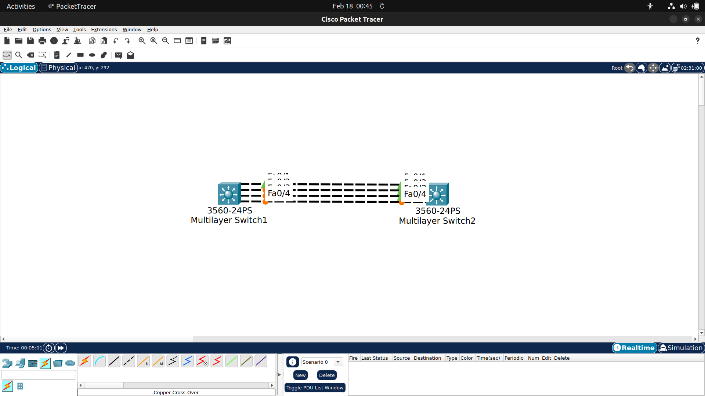
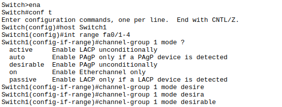
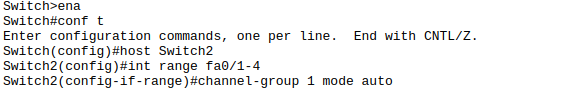
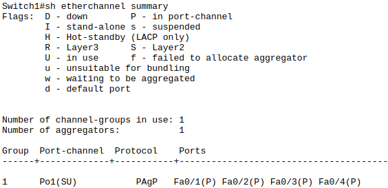
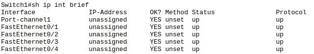
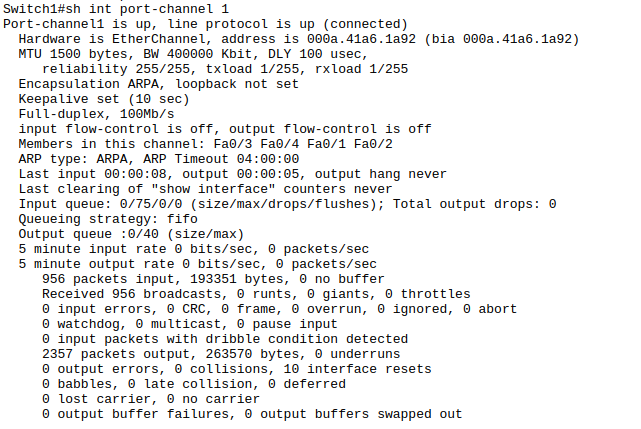

## Etherchannel
adalah teknologi yang digunakan untuk menggabungkan beberapa link fisik antara switch atau router ke dalam satu link logis dan memperlakukannya sebagai satu link.
Etherchannel berfungsi sebagai lick redundancy untuk mencegah link antar switch putus bila mengalami kendala dan juga berfungsi untuk menaikkan bandwidth pada link tersebut (link aggregation). STP tidak akan ngeblock port etherchannel karena dianggap satu logical interfaces.

## Mode Etherchannel
1. Port Aggregation Protocol (PAgP)
Protocol yang hanya bekerja pada cisco device, memiliki mode auto dan desirable.

2. Link Aggregation Control Protocol (LACP)
Protocoll yagn secara dinamis menegosiasikan pembentukan channel dengan switch lain, memiliki mode Active dan Passive.

3. Static (on)
Protocol ini tidak membutuhkan negosiasi, disisi lain link harus menggunakan mode yang sama.

## Syarat Etherchannel
`Pastikan seluruh interface dalam etherchannel dikonfigurasi secara identic`

1. Speed setting
2. Duplex setting
3. STP setting
4. Vlan membership
5. Native Vlan
6. Allowed Vlan
7. Trunking encapsulation

## Simulasi Etherchannel

## Mengaktifkan PaGP

## Verifikasi Etherchannel

> Output ``show etherchannel summary`` tersebut menunjukkan bahwa switch memiliki 1 EtherChannel aktif yaitu Port-channel 1 (Po1) yang berjalan di Layer 2 (S) dan dalam kondisi in use / aktif (U). EtherChannel ini menggunakan protokol PAgP (Cisco proprietary), dan terdiri dari 4 interface fisik yaitu Fa0/1 sampai Fa0/4 yang semuanya berstatus (P) artinya berhasil tergabung ke dalam port-channel tanpa error. Secara operasional ini berarti keempat link tersebut sudah dibundel menjadi satu link logis untuk meningkatkan bandwidth dan redundansi, dan STP akan melihatnya sebagai satu jalur saja, bukan empat link terpisah.

> Output ``show ip interface brief`` ini menunjukkan bahwa Port-channel1 dan semua interface FastEthernet (Fa0/1–Fa0/4) dalam kondisi up/up, artinya secara fisik (Layer 1) dan protokol (Layer 2) semuanya aktif dan berjalan normal. IP address masih unassigned, yang berarti ini kemungkinan besar digunakan sebagai Layer 2 switchport (bukan interface Layer 3 dengan IP). Karena EtherChannel sudah terbentuk sebelumnya, keempat port fisik itu sekarang bekerja sebagai anggota dari Port-channel1, dan status up/up menandakan bundling berhasil serta tidak ada masalah link atau negosiasi di kedua sisi.

> Output ``show interface port-channel 1`` ini menunjukkan bahwa Port-channel1 dalam kondisi sehat dan aktif (up/up, connected) dengan bandwidth agregat 400 Mbps (gabungan 4x100 Mbps FastEthernet). Interface berjalan di full-duplex 100 Mbps, MTU 1500, tanpa error serius seperti collision, CRC error, atau packet drop (semuanya 0), yang berarti tidak ada indikasi masalah fisik maupun mismatch duplex/speed. Terlihat juga member port-nya adalah Fa0/3, Fa0/4, Fa0/1, Fa0/2, artinya bundling berhasil. Statistik traffic sangat kecil (0 bits/sec dalam 5 menit terakhir), jadi link sedang idle atau tidak ada trafik signifikan. Secara keseluruhan, EtherChannel ini operasional normal, stabil, dan tidak menunjukkan gejala troubleshooting apa pun.