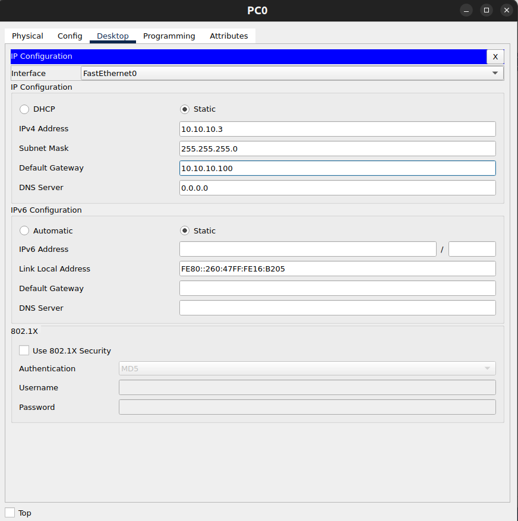
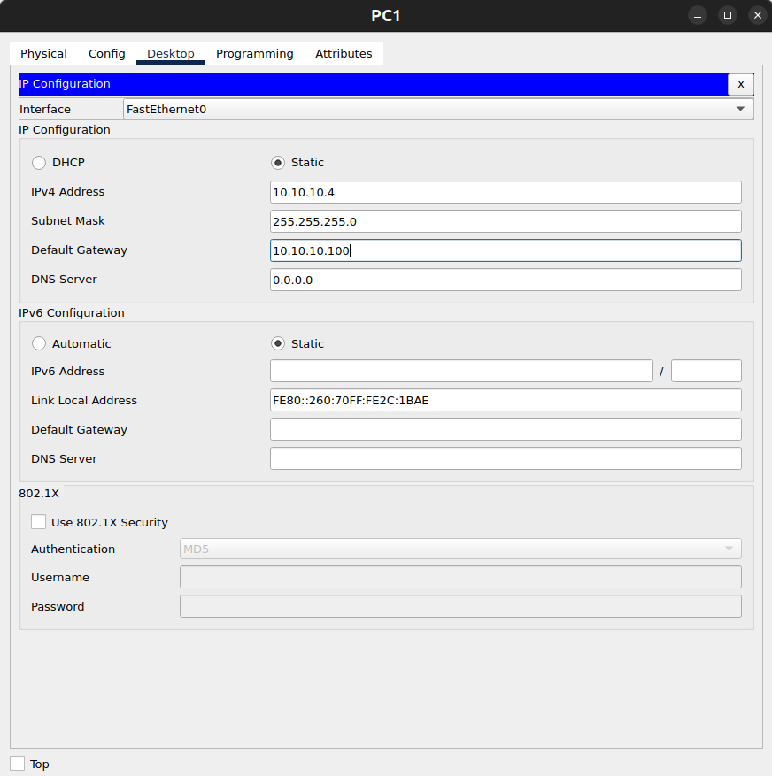

## Hot Standby Router Protocol (HSRP)
HSRP (Hot Standby Router Protocol) adalah protokol First Hop Redundancy Protocol (FHRP) yang digunakan untuk menyediakan gateway cadangan (redundancy) pada jaringan, sehingga jika router gateway utama gagal atau mati, router cadangan dapat secara otomatis mengambil alih peran sebagai gateway tanpa mengganggu koneksi jaringan.

HSRP bekerja dengan membuat virtual IP address yang digunakan oleh host sebagai default gateway. Beberapa router akan bergabung dalam satu HSRP group, di mana satu router berperan sebagai Active Router yang menangani trafik, sementara router lain menjadi Standby Router yang siap mengambil alih jika router aktif mengalami kegagalan. Dengan mekanisme ini, HSRP dapat menghilangkan single point of failure pada gateway jaringan dan meningkatkan ketersediaan serta keandalan jaringan.

### 5 Mekanisme dalam HSRP
1. Virtual IP & Virtual MAC
    HSRP membuat Virtual IP Address (VIP) yang digunakan oleh host sebagai default gateway. IP ini tidak dimiliki secara permanen oleh satu router, tetapi digunakan oleh router yang sedang berperan sebagai Active Router. Selain itu HSRP juga menggunakan Virtual MAC Address dengan format 0000.0c07.acXX (XX = nomor HSRP group). Host di jaringan hanya mengenali VIP tersebut sebagai gateway.

2. Hello Messages & Timers
    Router yang berada dalam satu grup HSRP saling mengirim Hello Message melalui multicast address 224.0.0.2 setiap 3 detik (Hello Timer). Jika router Standby tidak menerima Hello dari router Active selama 10 detik (Hold Timer), maka router Standby akan menganggap router Active gagal dan akan mengambil alih peran sebagai Active Router.

3. Election (Pemilihan Active Router)
    Proses pemilihan router yang menjadi Active Router dilakukan berdasarkan nilai priority dengan rentang 0–255 dan nilai default 100. Router dengan priority tertinggi akan menjadi Active Router. Jika nilai priority sama, maka router dengan alamat IP tertinggi yang akan dipilih.

4. Preemption
    Secara default, jika router Active yang sebelumnya mati kembali online, router tersebut tidak langsung mengambil kembali peran Active. Namun jika fitur preempt diaktifkan, router dengan priority lebih tinggi dapat secara otomatis merebut kembali posisi sebagai Active Router setelah kembali aktif.

5. Interface Tracking
    Fitur interface tracking memungkinkan HSRP memantau kondisi interface tertentu, misalnya koneksi ke jaringan WAN atau upstream. Jika interface tersebut mengalami gangguan atau down, maka nilai priority router akan diturunkan secara otomatis, sehingga router lain dalam grup HSRP dapat mengambil alih peran sebagai Active Router. Hal ini membuat proses failover lebih cerdas dan tidak hanya terjadi saat router mati.

## Simulasi

Topologi ini mensimulasikan implementasi HSRP (Hot Standby Router Protocol) untuk menyediakan redundansi gateway pada jaringan. Pada topologi ini, router R1 dan R2 terhubung ke jaringan LAN melalui sebuah switch dan dikonfigurasi dalam satu HSRP group dengan Virtual IP Address 192.168.1.100 yang digunakan sebagai default gateway oleh host. Salah satu router akan berperan sebagai Active Router yang menangani trafik jaringan, sedangkan router lainnya menjadi Standby Router yang siap mengambil alih jika router aktif mengalami kegagalan. Router R0 berfungsi sebagai jalur menuju jaringan luar, sementara PC0 dan PC1 merepresentasikan host dalam jaringan lokal. Dengan konfigurasi ini, jika salah satu router gateway gagal, router lainnya akan secara otomatis mengambil alih peran sehingga konektivitas jaringan tetap terjaga.

### R0 konfigurasi
```bash
Router>ena
Router#conf t
Enter configuration commands, one per line.  End with CNTL/Z.
Router(config)#host R0
R0(config)#int lo0
R0(config-if)#ip add 1.1.1.1 255.255.255.255
R0(config-if)#int fa0/0
R0(config-if)#ip add 11.11.11.1 255.255.255.0
R0(config-if)#no sh
R0(config-if)#int fa0/1
R0(config-if)#ip add 12.12.12.1 255.255.255.0
R0(config-if)#no sh
R0(config-if)#exit
R0(config)#router eigrp 100
R0(config-router)#network 0.0.0.0
R0(config-router)#end
R0#wr
Building configuration...
[OK]
```
### R1 konfigurasi
```bash
Router>ena
Router#conf t
Enter configuration commands, one per line.  End with CNTL/Z.
Router(config)#host R1
R1(config)#int fa0/0
R1(config-if)#ip add 11.11.11.2 255.255.255.0
R1(config-if)#no sh
R1(config-if)#int fa0/1
R1(config-if)#ip add 10.10.10.1 255.255.255.0
R1(config-if)#standby 1 ip 10.10.10.100
R1(config-if)#standby 1 priority 150
R1(config-if)#standby 1 preempt 
R1(config-if)#no sh
R1(config-if)#exit
R1(config)#router eigrp 100
R1(config-router)#network 0.0.0.0
R1(config-router)#end
R1#wr
Building configuration...
[OK]
```
- Perintah ```standby 1 ip 10.10.10.100``` digunakan untuk membuat Virtual IP (gateway) untuk HSRP group 1 yang akan dipakai oleh host.
- Perintah ```standby 1 priority 150``` digunakan untuk Menentukan prioritas router (default 100). Semakin tinggi semakin besar kemungkinan jadi Active Router.
- Perintah ```standby 1 preempt``` digunakan untuk mengizinkan router ini merebut kembali posisi Active jika sebelumnya kalah tapi punya priority lebih tinggi.
- Karena fokus ke HSRP untuk routing disini saya menggunakan EIGRP dengan default route.

### R2 konfigurasi
```bash
Router>ena
Router#conf t
Enter configuration commands, one per line.  End with CNTL/Z.
Router(config)#host R2
R2(config)#int fa0/0
R2(config-if)#ip add 12.12.12.2 255.255.255.0
R2(config-if)#no sh
R2(config-if)#int fa0/1
R2(config-if)#ip add 10.10.10.2 255.255.255.0
R2(config-if)#standby 1 ip 10.10.10.100
R2(config-if)#standby preempt 
R2(config-if)#no sh
R2(config-if)#exit
R2(config)#router eigrp 100
R2(config-router)#network 0.0.0.0
R2(config-router)#end
R2#wr
Building configuration...
[OK]
```
- Konfigurasi kurang lebih sama dengan ```R1``` yang membedakan cuma di prioritas router, karena ```R2``` adalah standby router jadi kita biarkan priotitas routernya default (100)

### PC0 konfigurasi


- Untuk default gateway host kita gunakan virtual ip (10.10.10.100)

### PC1 konfigurasi


- Untuk default gateway host kita gunakan virtual ip (10.10.10.100)

### Verifikasi
#### Case R1 hidup
```bash
R1#sh standby brief 
                     P indicates configured to preempt.
                     |
Interface   Grp  Pri P State    Active          Standby         Virtual IP
Fa0/1       1    150 P Active   local           10.10.10.2      10.10.10.100

R2#sh standby brief 
                     P indicates configured to preempt.
                     |
Interface   Grp  Pri P State    Active          Standby         Virtual IP
Fa0/1       1    100   Standby  10.10.10.1      local           10.10.10.100
```
> Perintah `show standby brief` digunakan untuk melihat status HSRP secara ringkas, dan dari output terlihat bahwa R1 berperan sebagai Active Router karena memiliki priority lebih tinggi (150) serta preempt aktif, sehingga menangani semua trafik ke virtual IP 10.10.10.100, sedangkan R2 menjadi Standby Router dengan priority lebih rendah (100) yang siap mengambil alih jika R1 gagal.

```bash
C:\>ping 1.1.1.1

Pinging 1.1.1.1 with 32 bytes of data:

Reply from 1.1.1.1: bytes=32 time<1ms TTL=254
Reply from 1.1.1.1: bytes=32 time<1ms TTL=254
Reply from 1.1.1.1: bytes=32 time<1ms TTL=254
Reply from 1.1.1.1: bytes=32 time<1ms TTL=254

Ping statistics for 1.1.1.1:
    Packets: Sent = 4, Received = 4, Lost = 0 (0% loss),
Approximate round trip times in milli-seconds:
    Minimum = 0ms, Maximum = 0ms, Average = 0ms

C:\>tracert 1.1.1.1

Tracing route to 1.1.1.1 over a maximum of 30 hops: 

  1   1 ms      0 ms      0 ms      10.10.10.1
  2   0 ms      0 ms      0 ms      1.1.1.1

Trace complete.
```
> Hasil ping dan tracert menunjukkan bahwa koneksi jaringan sudah berjalan dengan baik, di mana host berhasil mencapai tujuan 1.1.1.1 tanpa packet loss (0%) dan latency sangat kecil (<1 ms). Dari hasil tracert, terlihat bahwa hop pertama adalah 10.10.10.1 yang merupakan gateway (HSRP Active Router 1), kemudian langsung ke tujuan 1.1.1.1 pada hop kedua, yang menandakan jalur routing sudah optimal tanpa loop atau hambatan. Ini juga membuktikan bahwa HSRP berfungsi dengan benar, karena trafik dari host berhasil diarahkan melalui router Active sebagai gateway menuju jaringan tujuan.

#### Case R1 mati
```bash
R2#sh standby brief 
                     P indicates configured to preempt.
                     |
Interface   Grp  Pri P State    Active          Standby         Virtual IP
Fa0/1       1    100   Active   local           unknown         10.10.10.100  
```
> Terlihat bahwa R2 sekarang menjadi Active Router (State: Active, Active: local) karena tidak lagi menerima hello packet dari R1, sehingga mengambil alih virtual IP 10.10.10.100 sebagai gateway. Status Standby: unknown menandakan bahwa saat ini tidak ada router lain yang berperan sebagai standby (karena R1 down). Ini membuktikan bahwa mekanisme HSRP berjalan dengan baik, di mana router cadangan otomatis mengambil alih peran gateway tanpa mengganggu konektivitas jaringan.

```bash
C:\>ping 1.1.1.1

Pinging 1.1.1.1 with 32 bytes of data:

Reply from 1.1.1.1: bytes=32 time<1ms TTL=254
Reply from 1.1.1.1: bytes=32 time<1ms TTL=254
Reply from 1.1.1.1: bytes=32 time<1ms TTL=254
Reply from 1.1.1.1: bytes=32 time=23ms TTL=254

Ping statistics for 1.1.1.1:
    Packets: Sent = 4, Received = 4, Lost = 0 (0% loss),
Approximate round trip times in milli-seconds:
    Minimum = 0ms, Maximum = 23ms, Average = 5ms

C:\>tracert 1.1.1.1

Tracing route to 1.1.1.1 over a maximum of 30 hops: 

  1   0 ms      0 ms      0 ms      10.10.10.2
  2   1 ms      0 ms      0 ms      1.1.1.1

Trace complete.
```
> Hasil ping dan tracert setelah R1 dimatikan menunjukkan bahwa mekanisme failover HSRP berjalan dengan baik. Meskipun sempat terjadi sedikit kenaikan latency (hingga 23 ms) yang kemungkinan terjadi saat proses perpindahan Active Router, koneksi tetap stabil tanpa packet loss. Dari hasil tracert, terlihat bahwa hop pertama berubah menjadi 10.10.10.2 yang menandakan R2 kini menjadi Active Router dan berfungsi sebagai gateway, menggantikan R1. Hal ini membuktikan bahwa HSRP berhasil menjaga ketersediaan jaringan, karena meskipun router utama mati, trafik tetap dapat diteruskan melalui router cadangan tanpa gangguan signifikan.

## Konfigurasi lanjutan
1. Pelacakan Interface (Interface Tracking):Memungkinkan HSRP memantau status interface tertentu dan melakukan failover jika interface tersebut mati:
```bash
R1-Primary(config)# track 1 interface serial 0/0/0 line-protocol
R1-Primary(config)# interface fastethernet 0/0
R1-Primary(config-if)# standby 1 track 1 decrement 30 (Jika serial 0/0/0 down, prioritas turun 30)
```
2. Konfigurasi Otentikasi (Authentication):Untuk tujuan keamanan, HSRP bisa diatur dengan otentikasi:
```bash
R1-Primary(config-if)# standby 1 authentication md5 key-string "MySecureKey"
R2-Backup(config-if)# standby 1 authentication md5 key-string "MySecureKey"
```
3. Penyesuaian Timer:Timer HSRP standar bisa diubah untuk konvergensi yang lebih cepat:
```bash
R1-Primary(config-if)# standby 1 timers 1 3 (Hello 1 detik, Holdtime 3 detik)
R2-Backup(config-if)# standby 1 timers 1 3
```