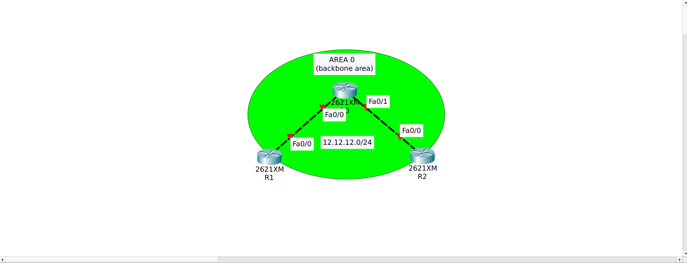
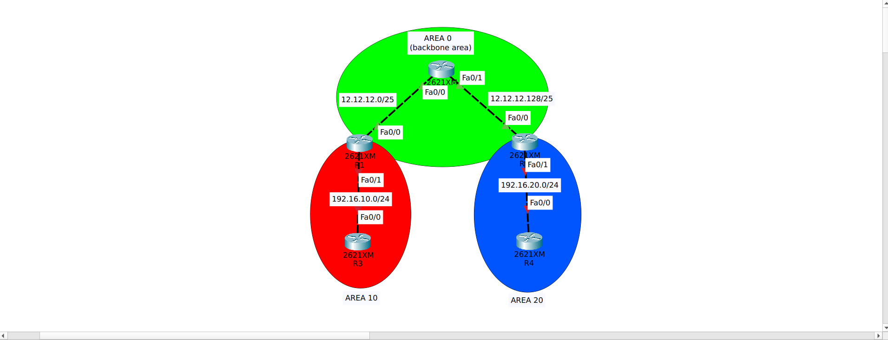

## Open Shortest Path First (OSPF)
adalah interior gateway protocol (IGP) yang banyak digunakan karena non-proprietary atau bisa digunakan multi vendor. OSPF menggunakan Link-State protocol yaitu setiap router membangun peta lengkap topologi jaringan lalu menghitung jalur terbaik sendiri. Dalam pemilihan jalur OSPF menggunakan algoritma shortest path first (SPF) atau Djikstra dengan tujuan mencari jalur dengan cost paling kecil.

### Cara kerja link-state
1. Neighbor Discovery
    Router mengirim Hello packet untuk mencari tetangga, di ospf ``224.0.0.5``.
    kalau parameter cocok:
    - area sama
    - subnet sama
    - hello timer sama
    mereka jadi neighbor.
2. Adjacency
    Router membangun hubungan lebih dalam, artinya router siap bertukar databse.
    `Tidak semua neighbor jadi adjacency. Pada jaringan multi access ospf akan memilih DR, BDR, dan DROTHER.`
3. Link State Advertisement(LSA)
    Router mengirim informasi:
    - Network yang dipunya
    - link yang terhubung
    - Cost dari link
4. Flooding
    LSA tidak hanya dikirim ke satu router. Router akan flood ke semua router diarea jadi semua router mendapatkan informasi topologi yang sama. Ini disebut LSDB - Syncronization.
5. Link State Database(LSDB)
    Semua router menyimpan datbase topology, isi LSDB adalah peta jaringan lengkap.
6. SPF Calculation
    Router menjalankan algoritma SPF (Shortest Path First) atau Djikstra. Tujuannya mencari jalur dengan cost paling kecil, dan hasil perhitungannya masuk ke routing tabel.

### NOTE
OSPF tidak terus menerus mengirim routing update seperti RIP, OSPF hanya mengirim update ketika ada perubahan topologi tapi tetap ada mekanisme maitanance supaya database tetap syncron

kondisi normal:
router mengirim hello packet setiap 10 detik, tujuannya untuk memastikan neighbor masih hidup.

kondisi ada perubahan:
misal link putus, router mati, interface down, atau penambahan network
maka router akan:
- Generate LSA baru
- Flood LSA ke semua router dalam area
- Semua router update LSDB
- SPF Calculation
- Update routing table

ini biasa disebut ``Triggered Update``

### Jenis - jenis router 
1. Internal router
    Router dengan interface ospf dalam satu area yang sama
2. Backbone Router
    Router yang memiliki interface di area 0 (Backbone Area)
3. Area Border Router(ABR)
    Router yang menghubungkan area 0 dengan area lain
4. Autonomous System Boundary Router(ASBR)
    Router yang memasukkan router dari luar OSPF kedalam OSPF (redistribute)

```Aturan id OSPF semua area harus terhubung ke backbone area, namun jika area tersebut tidak memungkinkan untuk terhubung langsung dengan backbone area bisa menggunakan virtual link(tunnel ospf)```

## Simulasi Routing OSPF
### Single area

Topologi ini merupakan simulasi OSPF single-area dengan tiga router (R0, R1, dan R2) yang saling terhubung dalam Area 0 sebagai backbone. Konfigurasi ini memungkinkan router membentuk neighbor dan bertukar informasi routing untuk menentukan jalur terbaik menggunakan algoritma SPF.

### R0 konfigurasi
```bash
Router>ena
Router#conf t
Router(config)#host R0
R0(config)#int lo0
R0(config-if)#ip add 1.1.1.1 255.255.255.255
R0(config-if)#ip ospf 1 area 0
R0(config-if)#int fa0/0
R0(config-if)#ip add 12.12.12.1 255.255.255.128
R0(config-if)#ip ospf network point-to-point 
R0(config-if)#ip ospf 1 area 0
R0(config-if)#no sh
R0(config-if)#int fa0/1
R0(config-if)#ip add 12.12.12.129 255.255.255.128
R0(config-if)#ip ospf network point-to-point 
R0(config-if)#ip ospf
R0(config-if)#ip ospf 1 are
R0(config-if)#ip ospf 1 area 0
R0(config-if)#no sh
R0(config-if)#exit
R0(config)#router ospf 1
R0(config-router)#router-id 1.1.1.1
R0(config-router)#exit
R0(config)#do wr
Building configuration...
[OK]
```

### R1 konfigurasi
```bash
Router>ena
Router#conf t
Router(config)#host R1
R1(config)#int lo0
R1(config-if)#ip add 2.2.2.2 255.255.255.255
R1(config-if)#ip ospf 1 area 0
R1(config-if)#int fa0/0
R1(config-if)#ip add 12.12.12.2 255.255.255.128
R1(config-if)#ip ospf network point-to-point 
R1(config-if)#ip ospf 1 area 0
R1(config-if)#no sh
R1(config-if)#exit
R1(config)#router ospf 1
R1(config-router)#rou
R1(config-router)#router-id 2.2.2.2
R1(config-router)#exit
R1(config)#do wr
```

### R2 konfigurasi
```bash
Router>ena
Router#conf t
Router(config)#host R2
R2(config)#int lo0
R2(config-if)#ip add 3.3.3.3 255.255.255.255
R2(config-if)#ip ospf 1 area 0
R2(config-if)#int fa0/0
R2(config-if)#ip add 12.12.12.130 255.255.255.128
R2(config-if)#ip ospf network point-to-point 
R2(config-if)#ip ospf 1 area 0
R2(config-if)#no sh
R2(config-if)#exit
R2(config)#router ospf 1
R2(config-router)#router-id 3.3.3.3
R2(config-router)#exit
R2(config)#do wr
Building configuration...
[OK]
```

### Multi Area

Topologi ini merupakan simulasi OSPF multi-area dengan Area 0 sebagai backbone yang menghubungkan Area 10 dan Area 20. Router R1 dan R2 berperan sebagai ABR yang menghubungkan jaringan di masing-masing area, yaitu 192.16.10.0/24 pada Area 10 dan 192.16.20.0/24 pada Area 20. Komunikasi antar area dilakukan melalui Area 0 sebagai pusat pertukaran routing.

### R1 konfigurasi
```bash
R1(config)#int fa0/1
R1(config-if)#ip add 192.16.10.1 255.255.255.0
R1(config-if)#ip ospf network point-to-point 
R1(config-if)#ip ospf 1 area 10
R1(config-if)#no sh
R1(config-if)#exit
R1(config)#do wr
Building configuration...
[OK]
```

### R2 konfigurasi
```bash
R2(config)#int fa0/1
R2(config-if)#ip add 192.16.20.1 255.255.255.0
R2(config-if)#ip ospf network point-to-point 
R2(config-if)#ip ospf 1 area 20
R2(config-if)#no sh
R2(config-if)#exit
R2(config)#do wr
Building configuration...
[OK]
```

### R3 konfigurasi
```bash
Router>ena
Router#conf t
Router(config)#host R3
R3(config)#int lo0
R3(config-if)#ip add 4.4.4.4 255.255.255.255
R3(config-if)#ip ospf 1 area 10
R3(config-if)#int fa0/0
R3(config-if)#ip add 192.16.10.2 255.255.255.0
R3(config-if)#ip ospf network point-to-point 
R3(config-if)#ip ospf 1 area 10
R3(config-if)#no sh
R3(config-if)#exit
R3(config)#router ospf 1
R3(config-router)#router-id 4.4.4.4
R3(config-router)#exit 
R3(config)#do wr
Building configuration...
[OK]
```

### R4 konfigurasi
```bash
Router>ena
Router#conf t
Router(config)#host R4
R4(config)#int lo0
R4(config-if)#ip add 5.5.5.5 255.255.255.255
R4(config-if)#ip ospf 1 area 20
R4(config-if)#int fa0/0
R4(config-if)#ip add 192.16.20.2
R4(config-if)#ip add 192.16.20.2 255.255.255.0
R4(config-if)#ip ospf network point-to-point 
R4(config-if)#ip ospf 1 area 20
R4(config-if)#no sh
R4(config-if)#exit
R4(config)#router ospf 1
R4(config-router)#rou
R4(config-router)#router-id 5.5.5.5
R4(config-router)#exit
R4(config)#do wr
Building configuration...
[OK]
R4(config)#
```
### Verifikasi dari R0
```bash
R0#sh ip route
Codes: C - connected, S - static, I - IGRP, R - RIP, M - mobile, B - BGP
       D - EIGRP, EX - EIGRP external, O - OSPF, IA - OSPF inter area
       N1 - OSPF NSSA external type 1, N2 - OSPF NSSA external type 2
       E1 - OSPF external type 1, E2 - OSPF external type 2, E - EGP
       i - IS-IS, L1 - IS-IS level-1, L2 - IS-IS level-2, ia - IS-IS inter area
       * - candidate default, U - per-user static route, o - ODR
       P - periodic downloaded static route

Gateway of last resort is not set

     1.0.0.0/32 is subnetted, 1 subnets
C       1.1.1.1 is directly connected, Loopback0
     2.0.0.0/32 is subnetted, 1 subnets
O       2.2.2.2 [110/2] via 12.12.12.2, 00:09:26, FastEthernet0/0
     3.0.0.0/32 is subnetted, 1 subnets
O       3.3.3.3 [110/2] via 12.12.12.130, 00:09:26, FastEthernet0/1
     4.0.0.0/32 is subnetted, 1 subnets
O IA    4.4.4.4 [110/3] via 12.12.12.2, 00:09:26, FastEthernet0/0
     5.0.0.0/32 is subnetted, 1 subnets
O IA    5.5.5.5 [110/3] via 12.12.12.130, 00:09:26, FastEthernet0/1
     12.0.0.0/25 is subnetted, 2 subnets
C       12.12.12.0 is directly connected, FastEthernet0/0
C       12.12.12.128 is directly connected, FastEthernet0/1
O IA 192.16.10.0/24 [110/2] via 12.12.12.2, 00:09:26, FastEthernet0/0
O IA 192.16.20.0/24 [110/2] via 12.12.12.130, 00:09:26, FastEthernet0/1
```
> Perintah ```show ip route``` digunakan untuk melihat routing table pada router, yaitu daftar jaringan tujuan dan jalur (next-hop atau interface) yang digunakan router untuk mengirim paket ke jaringan tersebut.

```bash
R0#sh ip route ospf
     2.0.0.0/32 is subnetted, 1 subnets
O       2.2.2.2 [110/2] via 12.12.12.2, 00:15:09, FastEthernet0/0
     3.0.0.0/32 is subnetted, 1 subnets
O       3.3.3.3 [110/2] via 12.12.12.130, 00:15:09, FastEthernet0/1
     4.0.0.0/32 is subnetted, 1 subnets
O IA    4.4.4.4 [110/3] via 12.12.12.2, 00:15:09, FastEthernet0/0
     5.0.0.0/32 is subnetted, 1 subnets
O IA    5.5.5.5 [110/3] via 12.12.12.130, 00:15:09, FastEthernet0/1
O IA 192.16.10.0 [110/2] via 12.12.12.2, 00:15:09, FastEthernet0/0
O IA 192.16.20.0 [110/2] via 12.12.12.130, 00:15:09, FastEthernet0/1
```
> Perintah ```show ip route ospf``` digunakan untuk menampilkan hanya route (jalur) yang dipelajari atau didapat dari protokol routing OSPF di dalam routing table. 0 berarti routing table tersebut didapat dari OSPF sementara, 0 IA berarti OSPF berasal dari beda area, [110/2] berarti AD(Administrative Distance) bernilai 110 dan cost metric bernilai 2.

```bash
R0#sh ip ospf neighbor 

Neighbor ID     Pri   State           Dead Time   Address         Interface
2.2.2.2           0   FULL/  -        00:00:39    12.12.12.2      FastEthernet0/0
3.3.3.3           0   FULL/  -        00:00:39    12.12.12.130    FastEthernet0/1
```
> Perintah ```show ip ospf neighbor``` digunakan untuk menampilkan daftar router tetangga yang telah membentuk hubungan (adjacency) OSPF dengan router kita. Outputnya menunjukkan Router ID tetangga (Neighbor ID), prioritas router (Pri) untuk pemilihan DR/BDR, status hubungan OSPF (State) seperti FULL atau 2WAY, waktu sisa sebelum neighbor dianggap down (Dead Time), alamat IP tetangga pada link tersebut (Address), serta interface yang digunakan untuk terhubung (Interface). Perintah ini biasanya digunakan untuk memastikan apakah proses neighbor adjacency OSPF sudah terbentuk dengan benar atau belum.

```bash
R0#sh ip protocols 

Routing Protocol is "ospf 1"
  Outgoing update filter list for all interfaces is not set 
  Incoming update filter list for all interfaces is not set 
  Router ID 1.1.1.1
  Number of areas in this router is 1. 1 normal 0 stub 0 nssa
  Maximum path: 4
  Routing for Networks:
  Routing Information Sources:  
    Gateway         Distance      Last Update 
    1.1.1.1              110      00:00:39
    2.2.2.2              110      00:00:40
    3.3.3.3              110      00:00:40
  Distance: (default is 110)
```
> Perintah ```show ip protocols``` digunakan untuk menampilkan informasi konfigurasi dan status protokol routing yang berjalan pada router. Dari output tersebut terlihat bahwa router R0 menjalankan OSPF process 1 dengan Router ID 1.1.1.1 dan hanya memiliki 1 area normal. Nilai Administrative Distance OSPF adalah 110 dengan maximum path 4 yang berarti router dapat menggunakan hingga empat jalur dengan cost yang sama. Pada bagian Routing Information Sources terlihat router menerima informasi routing dari router dengan Router ID 1.1.1.1, 2.2.2.2, dan 3.3.3.3, yang menunjukkan router tersebut menjadi sumber pertukaran informasi routing OSPF dalam jaringan.

```bash
R0#sh ip ospf database 
            OSPF Router with ID (1.1.1.1) (Process ID 1)

                Router Link States (Area 0)

Link ID         ADV Router      Age         Seq#       Checksum Link count
1.1.1.1         1.1.1.1         202         0x80000006 0x0089d0 5
3.3.3.3         3.3.3.3         203         0x80000004 0x002e0e 3
2.2.2.2         2.2.2.2         203         0x80000004 0x003a0f 3

                Summary Net Link States (Area 0)
Link ID         ADV Router      Age         Seq#       Checksum
192.16.10.0     2.2.2.2         198         0x80000003 0x005a1f
192.16.20.0     3.3.3.3         194         0x80000003 0x00cd9d
5.5.5.5         3.3.3.3         194         0x80000004 0x0056e3
4.4.4.4         2.2.2.2         193         0x80000004 0x00a29f
```
> Perintah ```show ip ospf database``` digunakan untuk menampilkan LSDB (Link-State Database) yang dimiliki router dalam protokol OSPF, yaitu database yang berisi informasi topologi jaringan yang diperoleh dari LSA (Link-State Advertisement). Pada output terlihat bahwa router R0 dengan Router ID 1.1.1.1 memiliki beberapa Router Link States di Area 0 yang berasal dari router dengan Router ID 1.1.1.1, 2.2.2.2, dan 3.3.3.3, yang menunjukkan ketiga router tersebut berada dalam area yang sama dan saling bertukar informasi topologi. Selain itu terdapat Summary Net Link States, yaitu LSA yang dihasilkan oleh ABR untuk mengiklankan jaringan dari area lain ke Area 0, seperti network 192.16.10.0 dan 192.16.20.0 serta alamat 4.4.4.4 dan 5.5.5.5, sehingga router dalam Area 0 dapat mengetahui dan mencapai jaringan yang berada di area OSPF lain.

```bash
R0#ping 4.4.4.4

Type escape sequence to abort.
Sending 5, 100-byte ICMP Echos to 4.4.4.4, timeout is 2 seconds:
!!!!!
Success rate is 100 percent (5/5), round-trip min/avg/max = 0/0/0 ms
```
> Perintah ```ping 4.4.4.4``` digunakan untuk menguji konektivitas antara router (R0) dengan router tujuan (RID 4.4.4.4) menggunakan packet ICMP. Output menunjukkan success rate 100% yang artinya berhasil terkoneksi.

```bash
R0#ping 5.5.5.5

Type escape sequence to abort.
Sending 5, 100-byte ICMP Echos to 5.5.5.5, timeout is 2 seconds:
!!!!!
Success rate is 100 percent (5/5), round-trip min/avg/max = 0/0/0 ms
```
> Perintah ```ping 5.5.5.5``` digunakan untuk menguji konektivitas antara router (R0) dengan router tujuan (RID 5.5.5.5) menggunakan packet ICMP. Output menunjukkan success rate 100% yang artinya berhasil terkoneksi.

### Troubleshooting
1. Kenapa OSPF didefinisikan di interface, bukan di router ospf 1
    OSPF bisa diaktifkan dengan dua cara, yaitu menggunakan network statement pada mode router ospf atau langsung pada interface. Pada konfigurasi ini OSPF diaktifkan di interface menggunakan perintah ip ospf 1 area 10 agar lebih spesifik dan mudah dikontrol, karena router hanya menjalankan OSPF pada interface yang benar-benar digunakan tanpa harus menggunakan wildcard mask seperti pada network statement.
    ```bash
    #mode router ospf
    !router ospf 1
    !network 192.168.10.0 0.0.0.255 area 0
    !network 10.10.10.0 0.0.0.3 area 0

    #mode langsung interface
    !int fa0/0
    !ip route ospf 1 area 0
    ```
2. Kenapa menggunakan ip ospf network point-to-point
    Perintah ```ip ospf network point-to-point``` digunakan untuk mengubah tipe jaringan OSPF menjadi point-to-point, yang berarti link tersebut dianggap hanya menghubungkan dua router. Dengan tipe ini tidak terjadi pemilihan DR dan BDR, sehingga proses adjacency lebih sederhana dan efisien pada link router-ke-router.
3. Kenapa perlu router-id
    Router-id digunakan sebagai identitas unik router dalam protokol OSPF. Router ID dipakai untuk mengenali router saat pertukaran LSA, pembentukan neighbor, serta perhitungan jalur oleh algoritma SPF. Oleh karena itu setiap router harus memiliki Router ID yang unik agar tidak terjadi konflik dalam proses routing OSPF.