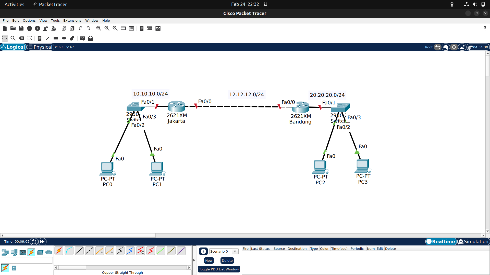
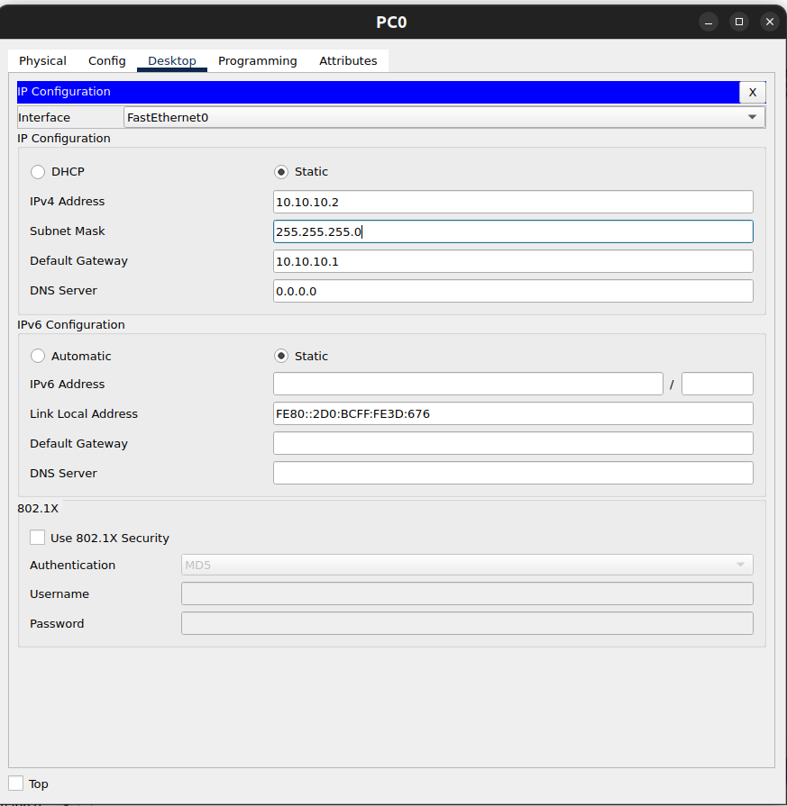
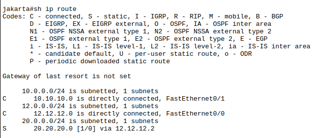
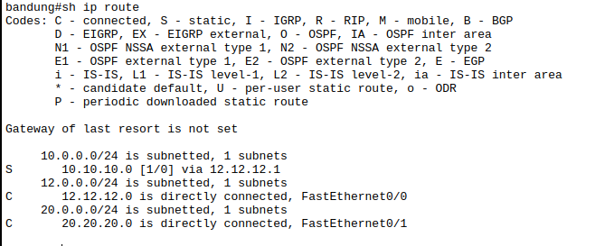
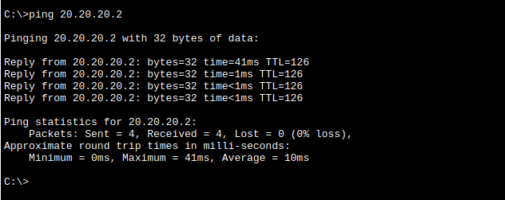

## Routing Static
> adalah jenis routing yang dilakukan manual oleh administrator, routing ini pada penggunaannya akan menghemat resource memory karena sifatnya manual. Seorang administrator harus memberitahukan secara manual next hop atau jalur yang aka dilewati baik menggunakan interface atau ip next hop.

format penulisan:
``#ip route (ip destination) (subnet mask) (exit interface/ip next hop)``

### Jenis - jenis static routing
1. Standart static routing
```#ip route 192.168.1.0 255.255.255.0 10.10.10.1```

2. Default route
```#ip route 0.0.0.0 0.0.0.0 8.8.8.8```
> nggak tahu kemana, kirim kesana. ini paling sering digunakan untuk internet gateway.

3. Floating static routing
```#ip route 10.10.10.0 255.255.255.0 172.16.0.2 5```
> Sering dipakai untuk backup routing, seperti failover dual ISP.

4. Null route
```ip route 10.10.10.0 255.255.255.0 null0```
> Route yang mengarahkan traffic ke interface virtual “null0” sehingga paket langsung dibuang (drop). dipakai untuk mencegah routing loop, summary route protection, dan blackhole trafik tertentu.

## LAB: Static Routing
Pada lab percobaan kali ini saya menggunakan 2 router, 2 switch, dan 4 PC.


### Konfigurasi Router Jakarta
```bash
Router>ena
Router#conf t
Enter configuration commands, one per line.  End with CNTL/Z.
Router(config)#host jakarta
jakarta(config)#int fa0/0
jakarta(config-if)#ip add 12.12.12.1 255.255.255.0
jakarta(config-if)#no sh
jakarta(config-if)#
%LINK-5-CHANGED: Interface FastEthernet0/0, changed state to up
jakarta(config-if)#int fa0/1
jakarta(config-if)#ip add 10.10.10.1 255.255.255.0
jakarta(config-if)#no sh
jakarta(config-if)#
%LINK-5-CHANGED: Interface FastEthernet0/1, changed state to up
%LINEPROTO-5-UPDOWN: Line protocol on Interface FastEthernet0/1, changed state to up
jakarta(config-if)#exit
jakarta(config)#ip route 20.20.20.0 255.255.255.0 12.12.12.2
jakarta(config)#do wr
Building configuration...
[OK]
jakarta(config)#
```

### Konfigurasi Router Bandung
```bash
Router>ena
Router#conf t
Enter configuration commands, one per line.  End with CNTL/Z.
Router(config)#host bandung
bandung(config)#int fa0/0
bandung(config-if)#ip add 12.12.12.2 255.255.255.0
bandung(config-if)#no sh
bandung(config-if)#
%LINK-5-CHANGED: Interface FastEthernet0/0, changed state to up
%LINEPROTO-5-UPDOWN: Line protocol on Interface FastEthernet0/0, changed state to up
bandung(config-if)#int fa0/1
bandung(config-if)#ip add 20.20.20.1 255.255.255.0
bandung(config-if)#no sh
bandung(config-if)#
%LINK-5-CHANGED: Interface FastEthernet0/1, changed state to up
%LINEPROTO-5-UPDOWN: Line protocol on Interface FastEthernet0/1, changed state to up
bandung(config-if)#exit
bandung(config)#ip route 10.10.10.0 255.255.255.0 12.12.12.1
bandung(config)#do wr
Building configuration...
[OK]
```

### Konfigurasi PC

lakukan konfigurasi yang sama pada semua pc, sesuaikan ip address dan ip gateway.

### Routing table
```Router Jakarta```


```Router Bandung```


> Pada routing tabel diatas ``S`` menunjukan bahwa routing table tsb berasal dari static route dan ``(1/0)`` menunjukkan ``AD = 1`` dengan ``matric = 0``

### Tes Ping antar PC
```PC0 - PC3```

