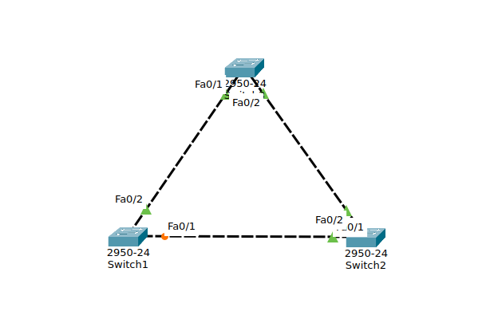
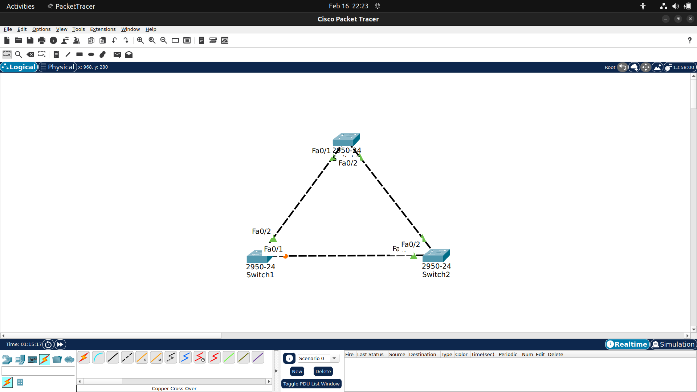
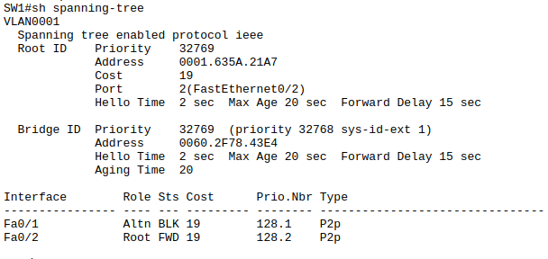
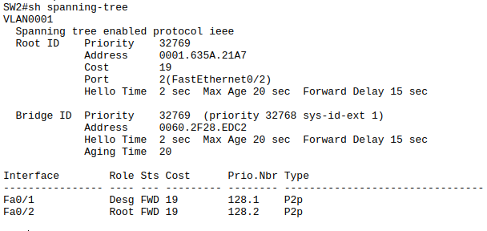
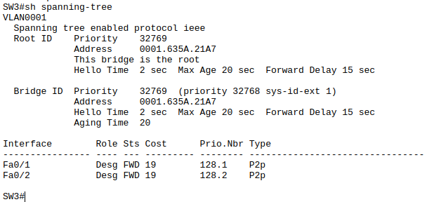
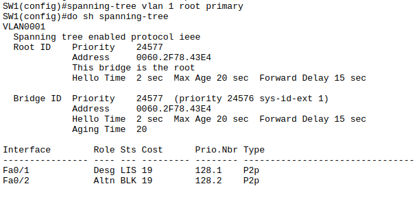
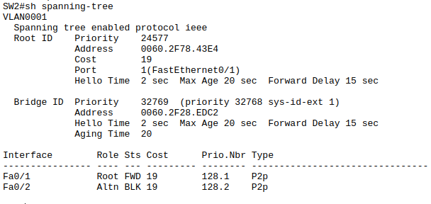
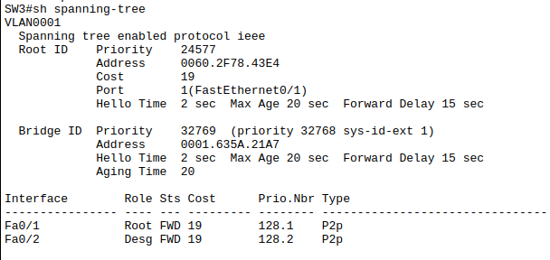

## Spanning Tree Protocol (STP)
Dalam desain jaringan layer 2, redundant adalah praktik yang umum dilakukan untuk memastikan high avability terpenuhi. Jika satu link putus, link yang lain dapat mengambil alih.
Namun Ethernet tidak memiliki mekanisme pembatas seperti TTL di layer 3, jika terjadi loop fisik antar switch frame dapat berputar tanpa henti, kondisi ini disebut dengan bridging loop.
Dampaknya:
- Broadcast storm
- MAC address table flapping
- CPU switch tinggi
- Seluruh LAN bisa down

Untuk mencegah bridging loop komite IEEE 802.1d mendefinisikan standar yang disebut dengan spanning tree protocol(STP), yaitu protocol manajement link yang menyediakan redudansi link sekaligus mencegah loop yang tidak diinginkan dalam jaringan dan bekerja dalam layer 2. Agar jaringan Ethernet berfungsi dengan baik, hanya satu link aktif yang dapat digunakan antara dua perangkat.

### Cara kerja spanning tree protocol
1. Memilih satu root bridge (switch) berdasarkan Bridge ID terendah
2. Memilih satu root port pada tiap nonroot bridge
3. Memilih satu designated port pada tiap network segment

### Simulasi

Pada percobaan kali ini saya menggunakan 3 switch yang saling terhubung.

STP akan memilih root berdasarkan priority terendah, jika priority sama maka akan memilih berdasarkan mac address terendah.Pada percobaan kali ini priority default sama yaitu 32769, jadi root akan dipilih berdasarkan mac address terendah yaitu switch3. Buktinya terdapat tulisan ``This bridge is the root``.

Tapi desain yang saya inginkan yang menjadi root bridge itu switch1 bukan switch3. Jadi selanjutnya kita akan merubah root bridgenya, yang awalnya switch3 menjadi switch1. Kita bisa melakukanya dengan perintah ``spanning-tree vlan 1 root primary``

## File pkt simulasi dapat didownload di ``pkt/spanningTreeProtocol.pkt``