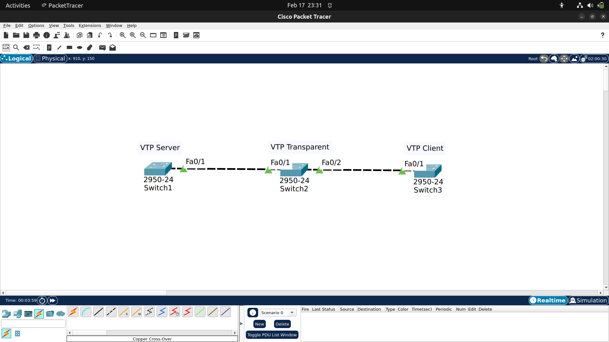
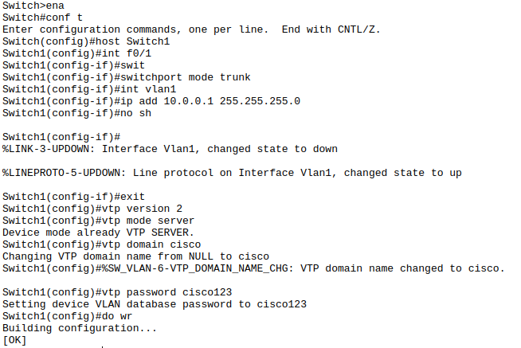
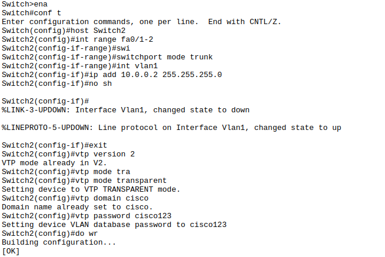
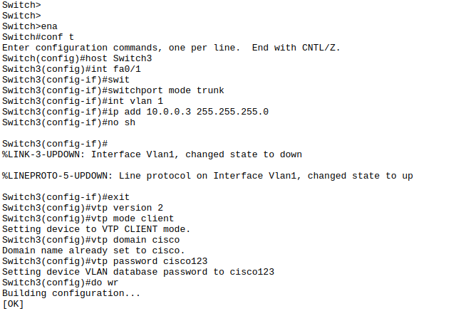
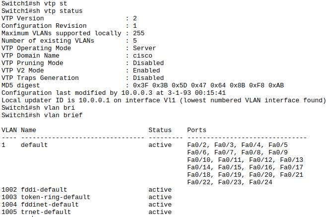
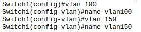
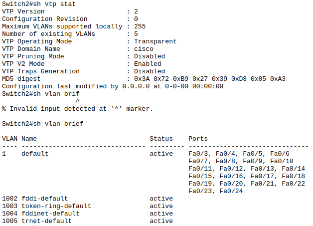

## VLAN Trunking Protocol (VTP)
VTP adalah protocol dari cisco yang digunakan untuk sinkronisasi database vlan diantara switch. Misal kita mengkonfigurasi vlan pada sebuah switch (mode server), maka switch yang lain (mode client) akan otomatis mengikuti, tapi jika kita ingin switch tidak mengikuti VTP server kita dapat mengaturnya menjadi mode transparant. Dalam mode ini switch tetap meneruskan VTP advertisement dari VTP server ke switch lain, tapi tidak membaca advertisement tersebut.
## Simulasi VTP di packet tracert

> Disini kita menggunakan 3 switch, switch1 mode server, switch2 mode transparent, dan switch3 mode client

### Konfigurasi vlan management dan vtp mode

### Verifikasi Vlan dan Vtp

> status diatas sama dengan Switch1, Switch2, Switch3 karena masih belum ada update dari vlan database jadi hanya memiliki 5 vlan default. Selanjutnya kita akan menambahkan vlan di Switch1.

### Menambahkan Vlan di Switch1

### Cek status di Switch2 dan Switch3

> dapat kita lihat pada Switch2 tidak terjadi perubahan karena vtp dalam mode transparent, sedangkan pada Switch3 terjadi perubahan penambahan vlan karena vtp mode client mengikuti switch1.