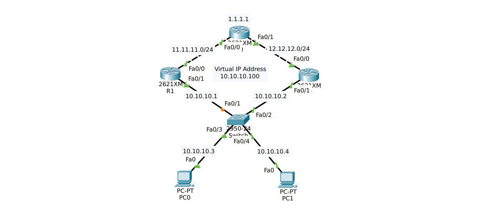

## Virtual Router Redundancy Protocol (VRRP)
adalah gateway redundansy protocol yang dikembangkan oleh IETF dan digunakan multi vendor. Cara kerjanya mirip dengan HSRP, router utama (master) dipilih untuk menangani trafik, sementara router lainnya (backup) siap mengambil alih jika router utama mengalami kegagalan. Perbedaan dengan HSRP terletak pada default timer yang hanya 1 detik, preempt secara default aktif, Virtual MAC.

## Simulasi

Pada simulasi VRRP kita menggunakan topology dan konfigurasi yang sama dengan HSRP, cuma yang nanti kita ubah bagian konfigurasi HSRPnya. Bisa dilihat dibagian [hsrp](./hsrp.md).

### Konfigurasi
```bash
R1(config-if)#standby 1 ip 10.10.10.100
R1(config-if)#standby 1 priority 150
R1(config-if)#standby 1 preempt 
```
Pada bagian ini(HSRP) ganti dengan konfigurasi VRRP:
```bash
R1(config-if)#vrrp 1 ip 10.10.10.100
R1(config-if)#vrrp 1 priority 150
```
### Konfigurasi lanjutan
1. Pengaturan Otentikasi:
```bash
VRRP-Master(config-if)# vrrp 1 authentication md5 key-string "VRRPSecure"
VRRP-Backup(config-if)# vrrp 1 authentication md5 key-string "VRRPSecure"
```
2. Optimasi Timer:
```
VRRP-Master(config-if)# vrrp 1 timers advertise 1 (Mengirim iklan setiap 1 detik)
VRRP-Backup(config-if)# vrrp 1 timers advertise 1
```
3. Integrasi Pelacakan Objek (Object Tracking):
```bash
VRRP-Master(config)# track 10 interface serial 0/0/0 line-protocol
VRRP-Master(config)# interface fastethernet 0/0
VRRP-Master(config-if)# vrrp 1 track 10 decrement 50 (Jika serial 0/0/0 down, prioritas turun 50)```